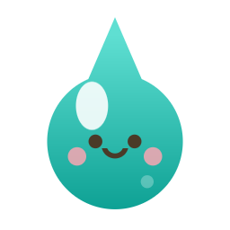
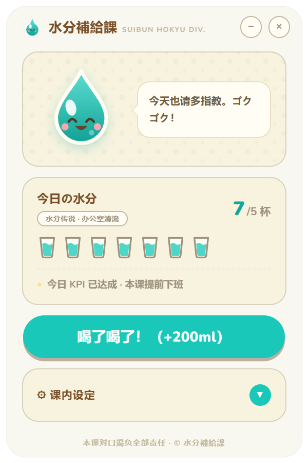
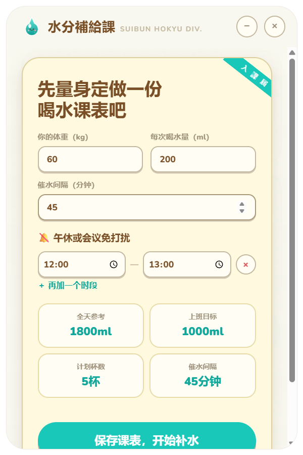
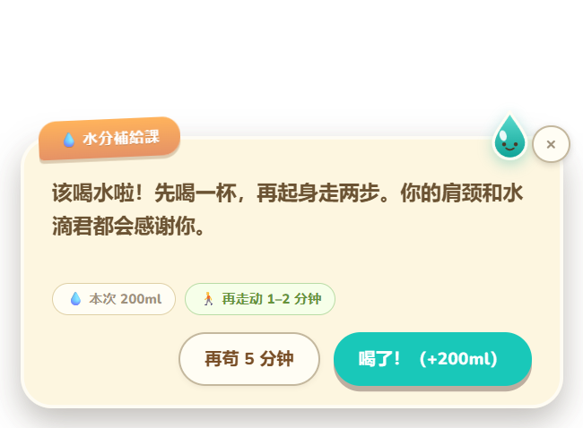

<p align="center">
  
</p>

<h1 align="center">水分補給課 GokuGoku</h1>

<p align="center">
  咕嘟咕嘟——专治上班族忘记喝水的 Windows 桌面小课<br>
  A playful Windows hydration reminder for busy desk workers
</p>

<p align="center">
  <a href="#中文">中文</a> · <a href="#english">English</a>
</p>

<p align="center">
  <a href="https://github.com/mosaic-dng/GokuGoku/releases/latest"><strong>下载最新版 / Download latest release</strong></a>
</p>

## 界面截图 / Screenshots

### 主界面 / Main window



### 入课设置 / Setup



### 催水提醒 / Hydration reminder



---

## 中文

### 这是什么？

GokuGoku 是一款动森风格的 Windows 喝水提醒应用。“GokuGoku（ゴクゴク）”是日语拟声词，意思接近中文的“咕嘟咕嘟、大口喝水”。

应用常驻系统托盘，只在你允许的工作时间内提醒。所有饮水数据只保存在本机，应用本身不会联网。

### 功能

- **量身设置**：输入体重、每次喝水量、提醒间隔和多个每日免打扰时段。
- **个性化目标**：全天参考量按 `体重(kg) × 30ml` 计算；上班目标根据工作时长折算。
- **准确累计**：内部按毫升保存记录，杯数会随当前杯容量重新计算。
- **免打扰调度**：午休、会议、下班后和非工作日不弹窗。
- **持续提醒**：允许提醒时，弹窗会等到你选择喝水、推迟或关闭。
- **喝水＋起身**：可同时提醒起身走动 1–2 分钟。
- **误点撤销**：主界面、托盘和提醒弹窗均提供短时撤销。
- **系统托盘常驻**：支持快速打卡、撤销、静音 1 小时和退出。
- **本地合成音效**：使用 WebAudio 现场生成，也可以关闭。

### 普通用户如何使用？

当前项目可从源码直接运行，也可以自行打包成 Windows x64 免安装便携版。如果你从未使用过命令行，请看：

**[零基础源码运行与 Windows 打包教程](docs/BUILDING.md)**

维护者发布新版本时，请参阅 **[Windows 便携版发布说明](docs/RELEASING.md)**。

最简步骤：

```powershell
npm install
npm test
npm start
```

生成便携版：

```powershell
npm run pack:win
```

成品位于 `dist/GokuGoku-win32-x64/`。请保留整个文件夹，不能只复制 `GokuGoku.exe`。

### 数据与隐私

数据保存在：

```text
%APPDATA%/水分補給課/gokugoku-data.json
```

从 v1.0 升级时，旧杯数按原来的 `250ml/杯` 估算迁移，并在同一目录保留 `gokugoku-data.v1.bak.json`。更改每次喝水量只影响之后的新打卡，不会改写已累计的毫升数。

### 测试与项目结构

```powershell
npm test
npm run pack:win
```

```text
main.js             Electron 主进程、调度、托盘和 IPC
preload.js          安全 IPC 桥
lib/hydration.js    饮水目标、免扰和输入校验
lib/data.js         数据迁移、打卡、重置和撤销
lib/scheduler.js    可测试的提醒状态机
ui/index.*          主面板、首次设置和完整设置
ui/reminder.*       持续提醒与短时撤销
test/*.test.js      Node 内置测试
docs/BUILDING.md    零基础运行与打包教程
```

### 说明

饮水计算是简易日常参考，不构成医疗建议。天气、运动量、饮食及健康状况都会影响实际饮水需要。

---

## English

### What is GokuGoku?

GokuGoku is a playful, Animal Crossing-inspired hydration reminder for Windows. “GokuGoku” (ゴクゴク) is a Japanese onomatopoeia for gulping down a drink.

The app lives in the system tray and reminds you only during the working hours you allow. Hydration data stays on your computer, and the app itself makes no network requests. The current application interface is primarily in Simplified Chinese.

### Features

- **Personal setup** — configure body weight, cup size, reminder interval, and multiple daily quiet periods.
- **Personalized targets** — estimate daily intake with `weight (kg) × 30 ml` and scale the workday target by working hours.
- **Accurate tracking** — store intake in millilitres and recalculate the displayed cup target from the current cup size.
- **Quiet-hour scheduling** — suppress reminders during lunch, meetings, off-hours, and non-working days.
- **Persistent reminders** — wait for you to drink, snooze, or close the reminder during eligible hours.
- **Drink and move** — optionally pair hydration reminders with a 1–2 minute movement break.
- **Quick undo** — undo an accidental entry from the main window, tray, or reminder popup.
- **System tray controls** — quickly log a drink, undo, mute for one hour, or quit.
- **Local synthesized sounds** — generate effects with WebAudio or disable them in settings.

### Getting started

You can run the project directly from source or package it as a portable Windows x64 application. If command-line tools are new to you, follow the step-by-step guide:

**[Beginner-friendly source and Windows packaging guide](docs/BUILDING.md#english)**

Maintainers publishing a new version should follow the **[Windows release guide](docs/RELEASING.md)**.

Quick start:

```powershell
npm install
npm test
npm start
```

Create the portable build:

```powershell
npm run pack:win
```

The output is placed in `dist/GokuGoku-win32-x64/`. Keep the entire folder together; `GokuGoku.exe` does not work as a standalone file.

### Data and privacy

Local data is stored at:

```text
%APPDATA%/水分補給課/gokugoku-data.json
```

When upgrading from v1.0, the app estimates previous entries using the original 250 ml cup size and keeps a `gokugoku-data.v1.bak.json` backup in the same directory. Changing the cup size affects future entries only.

### Testing and project structure

```powershell
npm test
npm run pack:win
```

```text
main.js             Electron main process, scheduling, tray, and IPC
preload.js          Secure IPC bridge
lib/hydration.js    Targets, quiet hours, and input validation
lib/data.js         Migration, drink records, reset, and undo
lib/scheduler.js    Testable reminder state machine
ui/index.*          Main panel, onboarding, and settings
ui/reminder.*       Persistent reminder and short undo window
test/*.test.js      Node built-in tests
docs/BUILDING.md    Beginner-friendly run and packaging guide
```

### Disclaimer

The hydration calculation is a simple everyday reference and is not medical advice. Weather, exercise, diet, medication, and health conditions can change individual needs.

---

## 友情链接 / Friends

- [LINUX DO](https://linux.do)

---

## License

Released under the [MIT License](LICENSE).
